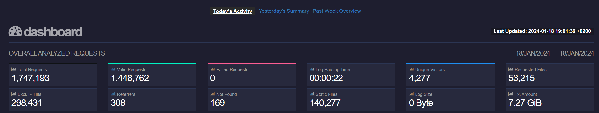

# GoAccess Report Generation Script

## Description
This script automates the process of generating log reports using GoAccess from a remote server. It supports generating reports for today, yesterday, or the past week, and modifies the report file to display navigation links to the corresponding reports.


## Requirements
- Bash
- SSH access to the remote server with key authentication
- GoAccess installed on the local machine, version 1.8.1 or higher (multithreading support is better, consider building from source. [Official Repo](https://github.com/allinurl/goaccess))
- (Optional) GeoIP databases if geographic location data is needed

## Installation
1. Clone the repository or download the script files.
```Bash
git clone https://github.com/vladkarok/goaccess-auto-report\
 ~/goaccess-auto-report
cd ~/goaccess-auto-report
```
2. Make the script executable (if not already): `chmod +x report.sh`

## Configuration
1. Edit `report-config.cfg` with your specific settings:
   - `REMOTE_USER`, `REMOTE_HOST`, etc. for SSH and log file details.
   - (Optional) Set `GEO_DB_ASN` and `GEO_DB_CITY` if using GeoIP databases.
   - (Optional) Set `FILTERED_IP` if you want to ignore some of them in your reports.
2. To serve the generated reports, there is an example nginx configuration in the nginx folder. Adjust it according to your server setup.

## Usage
Run the script with one of the following arguments:
- `./report.sh today` for today's log.
- `./report.sh yesterday` for yesterday's log.
- `./report.sh week` for the past week's logs.
For automation you can configure cron:
```
HOME="/home/{your_user}"
1 * * * * ${HOME}/goaccess-auto-report/report.sh today
5 0 * * * ${HOME}/goaccess-auto-report/report.sh yesterday
10 0 * * * ${HOME}/goaccess-auto-report/report.sh week
15 0 * * * ${HOME}/goaccess-auto-report/dbsizewatch.sh
```
In this example, today's report will be generated every hour at 01 minute, yesterday's report every day at 00:05, and the week's report every day at 00:10.

## Notes
- By default the script will use `$HOME/goaccess-auto-report` directory as `GOACCESS_HOME`. If you want to change it - make sure the user which executes the script has write permissions in it.
- There is a mostly default configuration file for goaccess itself in `goaccess.conf` with only changins like definition of `log-format COMBINED` and `anonymize-ip true`. You can change it in according to your needs.
- The week's report will be populated incrementally as more data is gathered each day due to the persist & restore ability of GoAccess. It will use the database folder to store data. If you want to immediately populate the database with all the necessary data, you can manually parse the log files using the --persist key.

## Contributing
Contributions to this script are welcome. Please fork the repository and submit a pull request with your changes.

